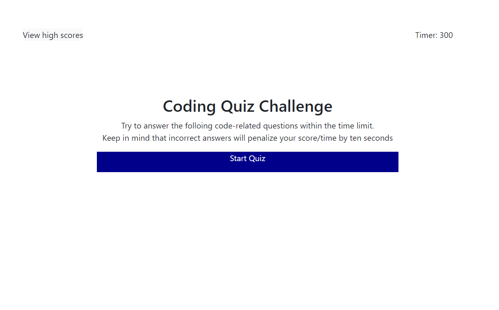

# Coding Quiz

## Contents
1. [Quiz Description](#quiz-description)
2. [Quiz Webpage](#quiz-webpage)

## Quiz Description
* There are five multiple choices in total and you have five minutes to finish them.
* The timer will be started once you click 'Start Quiz'.
* Each question only has one correct answer. When the correct answer is chosen, the next question will be shown automatically and the comment shows 'Correct'; otherwise the comment shows 'Wrong' and ten seconds will be subtracted from the clock.
* When all the questions are answered or the time runs out, the game is over.
* Your score will be the remaining time, and it can be saved by entering your initials and then click 'Submit' button.
* You can view all of your saved scores by clicking 'View high scores'.
* You can always do the questions again by click 'Go back' button.

## Quiz Webpage
https://pennyliu2022.github.io/Code-Quiz

